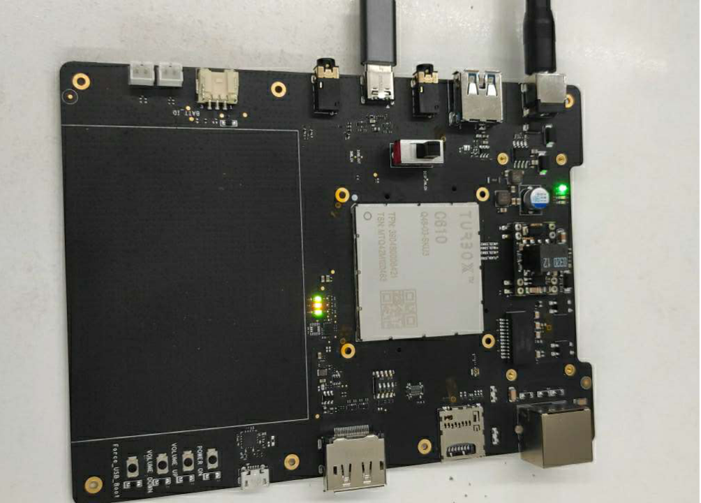

# Qualcomm TurboX C610 Open Kit SmartTraffic Developer documentation

## Introduce

This project is based on a open source [EasyPR](https://gitee.com/easypr/EasyPR) and Qualcomm Snapdragon SNPE SDK.Using The TurboX C610  Open Kit, combined with snpe, opencv and SVM, the localized license plate recognition process is completed to show its powerful computing power.The easypr license plate recognition engine is transplanted to the c610 development board to display the rich application scenes of c610.

The programe is build in x86 host with across complier tool and has been tested in TurboX C610 device.

<center>Turbox C610  Development board</center>




## Complie

The compilation of the whole project is based on the yocto compilation tool, so you need to write some .bb and .conf files according to the specification. The smarttraffic_0.1.bb example is as follows:

```
inherit cmake

DESCRIPTION = "smarttraffic demo"
LICENSE = "BSD"
SECTION = "smarttraffic"
LIC_FILES_CHKSUM = "file://${COMMON_LICENSE_DIR}/${LICENSE};md5=3775480a712fc46a69647678acb234cb"

# Dependencies.
DEPENDS := "opencv"

FILESPATH =+ "${WORKSPACE}/video_ai/smarttraffic/bin/:"

SRC_URI = "file://smarttraffic/"
INSANE_SKIP_${PN}-dev += "ldflags dev-elf dev-deps"
PACKAGES = "${PN}-dbg ${PN} ${PN}-dev"
S = "/home/turbox/wuqx0806/cs-610/apps_proc/src/video_ai/smarttraffic/"

# Install directries.
INSTALL_INCDIR := "${includedir}"
INSTALL_BINDIR := "${bindir}"
INSTALL_LIBDIR := "${libdir}"

EXTRA_OECMAKE += ""

FILES_${PN} += "${INSTALL_BINDIR}"
FILES_${PN} += "${INSTALL_LIBDIR}"

SOLIBS = ".so*"
FILES_SOLIBSDEV = ""
```

Please refer to [the official Manual of yocto]() for how to add layers,write layer.conf .Then,excute the command as follows:

```
bitbake smarttraffic
```

you will get a  executable bin file named smarttraffic.Move it to the root of the source code.Next,push the whole source code to TurboX C610 device`s dir /data.

```
adb root && adb disable-verity && adb reboot

adb root &&adb remount && adb shell mount -o remount,rw /

adb push xxx/xxx/sourcepath /data

adb shell

cd data/smarttraffic
```

## Usage

This project only provides a simple command line interface.

run smarttraffic：

```
$ ./smarttraffic // enter menu
$ ./smarttraffic ? // show help info
```

## Directory structure

The following table is the explanation of all contents in the project:


| Directory | explanation |
| - | - |
| src | all source code file |
| include | all include file |
| test | test procedure |
| model | model of machine learning |
| resources/text | Character mapping table |
| resources/train | Training data and instructions |
| resources/image | Pictures for testing |
| resources/doc | Related documents |
| tmp | The training data reading directory needs to be self built |

The following table explains the subdirectories in the resources / image directory:


| Directory | explanation |
| - | - |
| general_test | GDTS（General data test set） |
| native_test | NDTS（Local data test set） |
| tmp | In debug mode, the directory of intermediate pictures output by easypr needs to be self built |

The following table is an explanation of the subdirectories of the SRC Directory:


| Directory | explanation |
| - | - |
| core | Core functions |
| preprocess | SVM preprocessing |
| train | Training directory, store model training code |
| util | Auxiliary function |

The following table is the explanation and relationship of some core files in SRC Directory:


| Directory | explanation |
| - | - |
| plate_locate | License plate location |
| plate_judge | License plate judgment |
| plate_detect | License plate detection is the combination of license plate location and license plate judgment |
| chars_segment | Character segmentation |
| chars_identify | Character identification |
| chars_recognise | Character recognition is the combination of character segmentation and character identification |
| plate_recognize | License plate recognition is a common subclass of license plate detection and character recognition |
| feature | Feature extraction callback function |
| plate | Abstract license plate |
| core_func.h | Some common functions |

The following table explains the files in the test directory:


| Directory | explanation |
| - | - |
| main.cpp | Main command line window |
| accuracy.hpp | Batch testing |
| chars.hpp | Character recognition related |
| plate.hpp | License plate recognition correlation |

The following table explains the files in the train Directory:


| Directory | explanation |
| - | - |
| ann_train.cpp | Training binary character |
| annCh_train.hpp | Training Chinese gray characters |
| svm_train.hpp | Train license plate judgment |
| create_data.hpp | Generating synthetic data |
